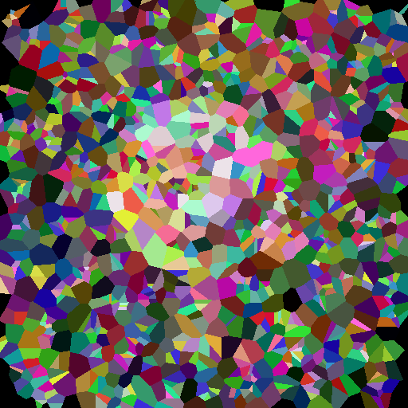

# Geney (Genetic Algorithm)

   

## Introduction
A genetic algorithm is a type of search and optimization based on biological concepts. The population represents the pool of possible solutions and they evolve by mutation and crossover. During each iteration, a part of the population is selected (usually the best fit) to survive. The survivors then mutate and breed to produce a new generation of chromosomes. The previous steps are repeated until the solutions converge to the desired output. One of the trickiest parts of applying genetic algorithms in digital art is choosing the fitness function. This is mainly because art is highly subjective which makes it hard to evaluate numerically. The approach that was taken here is to evaluate the difference from the desired image. And in order to compensate for the loss of evaluating artistic values in the fitness function, voronoi diagrams were used to add a sense of art with its uniformity mixed with the randomness offered by the genetic algorithm.

## Algorithm
The algorithm was written using `python 3.8`. The used libraries were `numpy`, `random`, `datetime`, `scipy`, and `opencv` (cv2). All images were read using `cv2` and drawn using `numpy` arrays and voronoi diagrams from `scipy`.
### Testing
To run the algorithm, you need `python 3.8` and `pip` installed. You can install required libraries by executing the command `pip install -r “requirements.txt”`. To quickly run the program execute the command `python3 main.py`. The program is initially configured to run on a sample image `sample00.png` which is located in the folder `testingImages` and produce output in the `output` folder. To run the program on another image you can change the value of the variable `targetName` at the beginning of `main.py` file. Multiple other samples can be found inside the folder `testingImages`.

The output in the terminal consists of the name of the image, the current generation number, and the respective fitness and it’s printed every 100 generations. The other part of the output is an image produced every 1000 generations which is the drawing of the voronoi diagram of the current generation’s genome (You can find it in `output` folder.
### Voronoi Diagrams
Voronoi diagram is a mathematical notation of a plane which is partitioned to regions (or cells) each of which is related to a single point (which in our case is represented by ColoredPoint class). Each pixel is in the region of the point that is closest to it and takes this point’s color. The polygons do not intersect as one pixel can’t be in more than one region at a time. In the program we use scipy library to calculate the vertices of the voronoi cells and convert them into polygons on an actual image using cv2 library.

### Representation
The solutions (genomes/chromosomes) were represented as a VoronoiDiagram class which is made of an array of ~1300 `ColoredPoint` (the number was manually chosen after a lot of trial and error) where each point has x, y coordinates and a color. the `ColoredPoint` class represents a gene and mutation are represented as a random change in the color of the point.
The choice of the number of points in each diagram is a tradeoff. Higher number of points means higher accuracy but increases the running time of the algorithm. So after experimenting on a number of 512x512 images, it was concluded that diagrams with a number of points 1150-1350 will lead to equally good results in a relatively low run time.

### Evolution
The algorithm starts with the initial (randomly generated) population of size 1. During each iteration, the individual is mutated exactly twice and the best one out of the 3 genomes is selected depending on their fitness score. This process is repeated roughly 150,000-170,000 times until the solution converges to the target image.

### Population
As mentioned before, the decided population size in the final version of the algorithm was only 1 diagram. This was also chosen after a lot of experimentation. The superiority of this version stems from the fact that the run time grows exponentially with respect to the population size and doesn’t significantly improve the images because there is no crossover phase (as opposed to typical genetic algorithms) so a population of size 1 or 2 is very sufficient in this case

### Mutation
The mutation phase is applied in each iteration before the selection. During this phase, one random `ColoredPoint` is chosen from the diagram, and either the color is changed or the coordinates are changed (both equally probable). In the color-changing mutation, each value of the three red, green, blue is changed slightly and independently by a random integer between -25, 25. In the coordinates-changing mutation, x and y values of the point are changed slightly and independently by a random integer between -15, 15.

### Crossover
Even though a crossover function was not used in the final algorithm, one was implemented and used in experimenting during earlier stages. The child of 2 parents was a VoronoiDiagram class that has approximately half of its points from each parent all randomly chosen.

### Fitness
The fitness function used was the mean square error function. It takes two images and prints the sum of the squared difference between their pixels divided by the area of the image. Notice that both images have to be of the same size and that the goal of the algorithm was to minimize this function.

### Selection
The selection process is simple. During each generation, 2 copies of the original genome are created and subjected to a random mutation. The genome with the best fitness out of the three (the 2 copies and the original) is then selected to survive to the next generation.

## Results

  
  

  
  

  
  

  
  

